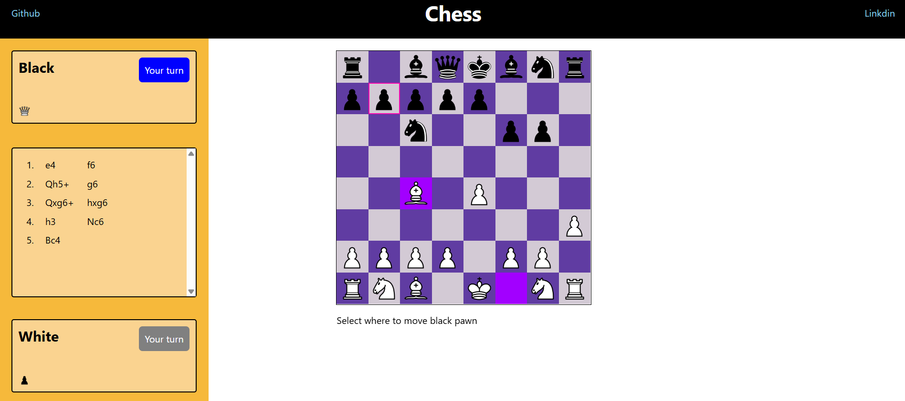

# ♟️ Chessapp

Welcome to **Chessapp**, a full-featured React-based chess game where pawns dream of promotions, kings tremble in check, and strategy meets style.

## 🚀 Features

- 🎮 Full chess gameplay with legal move validation
- 🧠 Check and checkmate detection
- 👑 Pawn promotion with UI popup (no more forced Queens!)
- 🔥 Red highlights when the King is in check
- 🪦 Graveyard to track captured pieces
- 🕰️ Move history for each turn
- 💅 Clean, responsive UI

## 🧱 Tech Stack

- React
- JavaScript
- CSS (Inline and Modules)

## 🖥️ How to Run

1. Clone the repo:
   ```bash
   git clone https://github.com/your-username/Chessapp.git
   cd Chessapp
   ```
2. npm install
3. npm start




## 📦 Future Enhancements

- 🔗 Multiplayer support
- ⏱️ Timer and scoring system
- 🤖 AI opponent (because losing to humans just isn't painful enough)

## 🤹‍♂️ Fun Fact

Every piece in this app has a midlife crisis — especially pawns when they realize they can be anything… even a Queen.

## 🧑‍💻 Author

Built with ❤️ by **Nithul**.
